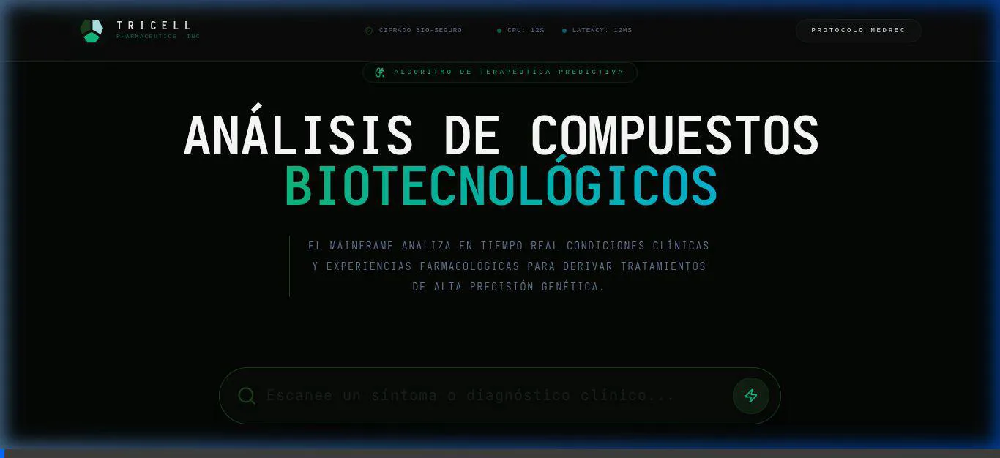
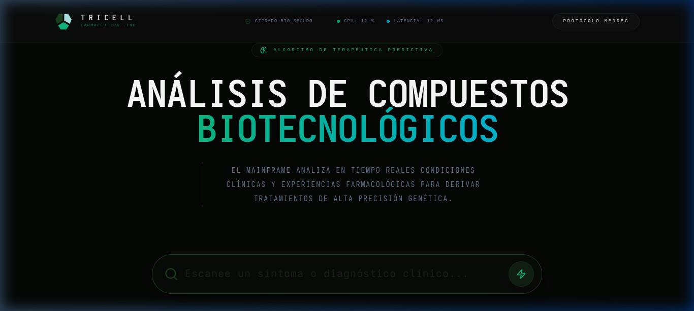
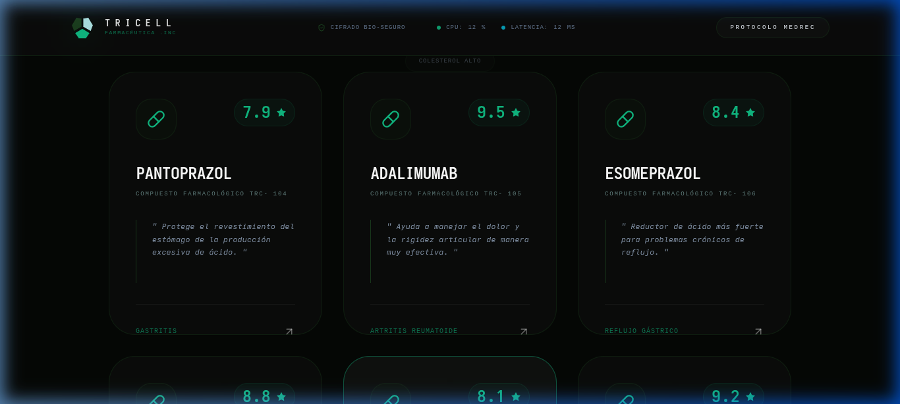

<div align="center">
  
  <h1>TRICELL INC.</h1>
  <p><i>Medical Technologies & Pharmaceuticals</i></p>
</div>

---

# ☣️ Proyecto 03: Sistema de Recomendación de Medicamentos

## 🎞️ Vista Previa del Sistema (Majestic UI)


<div align="center">
  
  
</div>

## 🏛️ Descripción General
El sistema **Tricell MedRec Majestic** es un motor de recomendación de medicamentos de alta fidelidad, diseñado para asistir en la identificación de compuestos basados en condiciones clínicas y síntomas reportados. Utiliza Procesamiento de Lenguaje Natural (PLN) avanzado para analizar una base de datos biogenética sintética y derivar recomendaciones con precisión quirúrgica.

## 🚀 Características del Protocolo
- **Búsqueda Robusta (N-Grams)**: Motor de búsqueda optimizado con análisis de sub-palabras para tolerar errores ortográficos (ej. entiende "astritirs" como "gastritis").
- **Interfaz Majestic de Una Sección**: Diseño minimalista premium en español, orientado a la eficiencia diagnóstica sin ruido visual.
- **Métricas Biomédicas en Tiempo Real**: Monitoreo de latencia del mainframe y carga de procesamiento bio-seguro.
- **Localización Total (ES)**: Datasets y etiquetas completamente en español técnico para operaciones regionales.

## 🛠️ Especificaciones Técnicas
- **Backend**: Python 3.12 + FastAPI (Mainframe Engine).
- **IA**: Scikit-Learn (TfidfVectorizer con N-grams de caracteres).
- **Frontend**: React 19 + Vite + Tailwind CSS 4 (Majestic Design).
- **Estética**: Glassmorphism avanzado, tipografía *Inter* y acentos Verde Esmeralda Tricell.

## ⚙️ Instrucciones de Operación

### 1. Configuración del Servidor (Mainframe)
Navegue al directorio raíz del proyecto:
```bash
cd 03_Sistema_Recomendacion_Medicamentos
python3 api/main.py
```
*El servidor se iniciará en el puerto 8001 por defecto.*

### 2. Despliegue de la Interfaz (Protocolo Majestic)
Navegue al directorio del frontend:
```bash
cd 03_Sistema_Recomendacion_Medicamentos/frontend
npm run dev
```
*Acceda a la interfaz en `http://localhost:5173`.*

## ⚠️ Aviso de Seguridad y Cumplimiento
Este sistema es una herramienta de asistencia diagnóstica de carácter informativo. Todas las prescripciones y compuestos biogenéticos deben ser validados por un supervisor médico de Nivel 04 bajo los protocolos de Tricell Biosafety Compliance. El mal uso de la información presentada es responsabilidad del operador civil.

---
**© 2026 Tricell Pharmaceutics .INC - Trabajando por un futuro biológico.**
